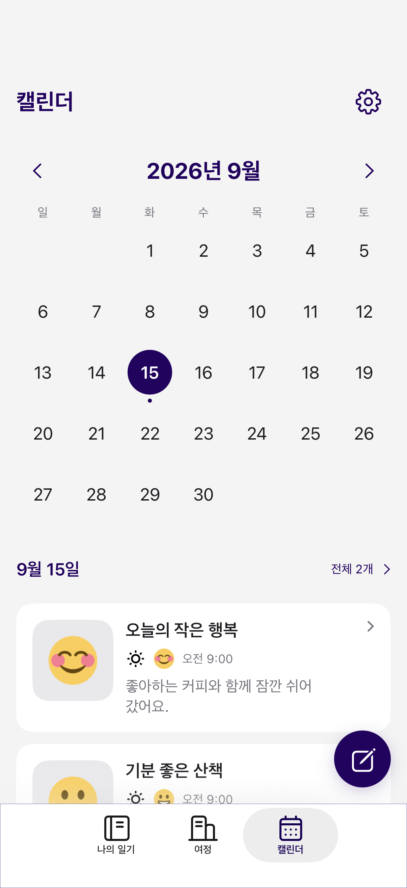

# Calendar 리팩토링

## 적용 범위

Calendar의 날짜별 처리, 조회 경계, 화면 상태를 분리하고 캘린더 탭을 SwiftUI에 연결했다.
기존 일기 작성/상세, 설정, UIKit 탭·탐색은 연결 adapter를 통해 사용한다.
Firebase 저장 경로·필드·계정·문서 ID는 변경하지 않는다.



## 책임과 협업 계약

| 구성 | 책임 |
|---|---|
| `Domain/DiaryEntry.swift` | 기존 Codable 일기 모델. UIKit 사진·셀 모델과 분리, 저장 필드 유지 |
| `Shared/DiaryDateFormatting.swift` | 기존 날짜 formatter. 저장 형식·offset 해석 유지 |
| `Domain/Calendar/CalendarDiaryIndex.swift` | 삭제 제외, 날짜별 최신순 분류, 점 갱신 대상, 월 그리드 |
| `Domain/DiaryReadingRepository.swift` | 일기 구독과 사용자 ID 관찰의 최소 인터페이스 |
| `Data/FirebaseDiaryReadingRepository.swift` | 기존 전체 기록 조회·Codable 디코딩, Firebase 구독 핸들 해제 |
| `Features/Calendar/CalendarViewModel.swift` | 월·선택 날짜·조회 상태와 사용자 변경/오류/재시도 처리 |
| `Features/Calendar/CalendarView.swift`, `CalendarDayListView.swift` | 캘린더·날짜별 목록 표시와 입력 |
| `Features/Calendar/CalendarHostingController.swift` | 기존 작성·상세·설정 화면 및 UIKit 탐색 연결 |
| `Features/Calendar/CalendarModule.swift` | 주입받은 의존성으로 화면 상태 구성. UIKit 연결은 `CalendarModule+UIKit.swift` |
| `DesignSystem/DiaryTheme.swift` | 기존 colorset을 공유하는 역할별 색상, 최소 타이포·여백·형태 기준 |

일기 모델과 formatter를 옮겼지만 사진/설정/온보딩 모델은 기존 `DataModel.swift`에 유지한다.
일기 모델과 formatter는 앱·hostless 테스트가 같은 운영 파일을 컴파일한다.
공통 Repository 작업 시 새 CRUD 체계를 중복 생성하지 않고 위 읽기 인터페이스를 통합한다.

운영 서비스 생성·주입은 [공통 의존성 관리](DEPENDENCIES.md)의 앱 진입 계층에서 담당한다.

## 조회와 상태 수명

- Calendar 기능의 루트가 로드되면 사용자 ID 관찰을 시작한다. 탭을 다시 선택해도 중복 시작하지 않는다.
- 사용자별 일기 구독은 하나다. 캘린더와 날짜별 목록은 같은 상태를 공유한다.
- 사용자 ID 변경 시 이전 구독을 취소하고 기록·선택 상태를 초기화한다.
- 구독 세대와 취소 상태를 확인해 이전 사용자의 늦은 응답을 무시한다.
- 기능 상태가 해제되면 관찰 작업을 취소한다. stream 종료/취소 시 SDK listener도 해제한다.
- 조회 오류는 빈 결과와 구분한다. 기존 내용이 있다면 유지하면서 오류와 재시도를 표시한다.
- 기존 작성 화면의 완료 콜백에서 전체 기록을 다시 구독하지 않는다. 정상 구독이 변경을 반영한다.

전체 기록 조회는 기존 범위를 유지한다. 월별 조회 최적화는 저장 날짜 문자열의 offset과
기간 경계 정확성을 검증한 별도 작업이다. 목록의 일부 페이지를 Calendar의 전체 기록으로 사용하지 않는다.

## 날짜와 화면 동작

- 날짜 분류·월 이동에 주입한 Calendar/TimeZone을 사용한다.
- 일기 날짜가 바뀌거나 삭제되면 이전 날짜와 새 날짜를 함께 점 갱신 대상으로 계산한다.
- 이전 연도의 기록도 처리한다. 같은 날짜에 여러 기록이 있어도 점은 하나다.
- 날짜별 목록은 실제 시각 기준 최신순, 같은 시각은 문서 ID로 순서를 고정한다.
- 잘못된 저장 날짜를 오늘로 대체하는 기존 동작은 유지한다. Calendar 테스트에서는 현재 시각을 주입한다.
- 기존 2011년 시작 범위를 유지하며 월 이동과 날짜 선택 sheet로 과거 연도·월에 접근한다.
- 날짜를 선택하면 하단에 최대 두 개의 일기를 표시한다. 날짜 제목을 누르면 전체 날짜별 목록을 연다.
- 미리보기/전체 목록의 일기를 누르면 기존 상세 화면을 연다. 작성과 설정도 기존 화면을 연결한다.
- 날짜별 목록에서 돌아와도 선택 날짜를 유지한다. 월 이동 시 해당 월의 첫 날짜를 선택한다.
- 제목과 일기 카드는 Dynamic Type을 따른다. 7열 날짜 그리드는 숫자 겹침을 방지하기 위해
  최대 `xxxLarge`까지 적용하고, 설정·작성 버튼의 아이콘은 고정 크기를 사용한다.

## 남겨 둔 UIKit 코드

`CalendarVC`와 `CalendarListVC`도 새 상태 모델을 사용하도록 연결하고, 기존 UIKit의
날짜 선택·목록 갱신·점 제거 흐름을 확인했다. 현재 탭은 `CalendarHostingController`를 사용한다.
이전 UIKit 화면과 셀은 실제 Firebase를 사용하는 통합 흐름의 동등성 확인 전까지 비교용으로 유지한다.
SnapKit은 다른 화면에서도 사용하므로 제거하지 않는다.

이미지는 기존 `ImageCacheManager`를 사용한다. URL 변경/화면 이탈 시 취소된 UI 작업의
늦은 결과를 반영하지 않는다. 기존 캐시 API는 다운로드 취소 핸들을 노출하지 않으므로
전송 자체의 취소와 공유 캐시 오류/로그 개선은 별도 서비스 작업이다.

## 검증

```sh
DEVELOPER_DIR=/Applications/Xcode.app/Contents/Developer bash scripts/ci.sh test
DEVELOPER_DIR=/Applications/Xcode.app/Contents/Developer bash scripts/ci.sh build
```

- 일기 모델 6개, Calendar 날짜/그리드 10개, fake 기반 화면 상태/구독 수명 11개: 총 27개 XCTest.
- 기존 동작 추출 후 삭제 제외·이전 연도 점 갱신·마지막 기록 삭제의 실패를 재현한 뒤 수정했다.
- `CalendarPreview.swift`에 기록·빈 결과·오류 Preview가 있다. 개인정보 없는 `CalendarPreviewData`를 사용한다.
- 오프라인 시뮬레이터 검증에서 운영 Calendar 소스를 사용한다. 저장소/세션은 fake,
  작성·상세·설정은 호출 계약을 확인하는 stub을 사용하며 운영 Firebase에 접근하지 않는다.
- iPhone 17 Pro / iOS 26.5에서 UIKit 날짜 선택·삭제 후 목록/점 갱신과 SwiftUI 월 이동·날짜 선택·
  미리보기·전체 목록·복귀·이전 연도 직접 이동·오류 후 재시도를 확인했다.
- 최대 접근성 글자 크기에서 날짜 숫자·버튼 아이콘과 날짜별 카드의 표시를 확인했다.
- SDK의 실제 디코딩, 로그인/익명 전환, 실서버 저장 후 갱신, 실사진 다운로드와 실제 작성 화면 동작은
  위 단위 테스트·빌드·오프라인 화면 검증만으로 보장하지 않는다. 별도 기기/Emulator 검증이 필요하다.
