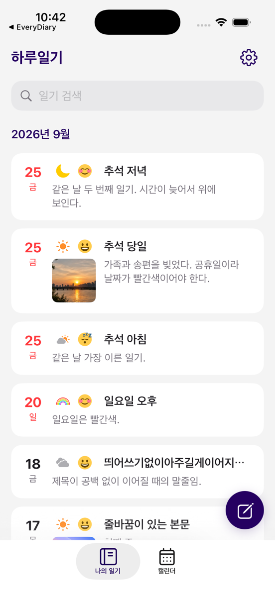

# 일기 목록 조회·검색 리팩토링

## 적용 범위

첫 탭 "나의 일기"의 조회·검색·월별 분류·휴지통 이동을 화면에서 분리하고, 같은 상태로
기존 UIKit `DiaryListVC`를 먼저 연결·검증한 뒤 목업 v2 기준 SwiftUI 화면으로 교체했다.
Firebase 저장 경로 `users/{uid}/diaries/{id}`와 필드·문서 ID는 변경하지 않는다.
일기 작성·상세·수정(`WriteDiaryVC`), 설정은 기존 UIKit을 연결해 사용한다. 휴지통은 [휴지통 리팩토링](TRASH_REFACTORING.md)에서 교체했다.



## 이전 동작에서 확인한 문제

| 문제 | 발생 조건 | 처리 |
|---|---|---|
| 페이지마다 Firestore listener를 추가하고 해제하지 않음 | 스크롤·새로고침·작성 후 반복 | 사용자별 단일 구독(`UserDiaryFeed`)으로 교체 |
| 검색마다 전체 기록 listener를 추가하고 이전 listener를 유지 | 검색어 변경·취소 후 데이터 변경 | 같은 구독 결과를 메모리에서 필터링 |
| 이전 검색어나 검색 취소 전의 결과가 목록을 덮어씀 | 위 listener가 나중에 응답 | 현재 검색어로만 섹션 재계산 |
| 업로드 중 셀이 모든 월 섹션에 추가되고 선택 인덱스가 한 칸 밀림 | 새 일기 저장 중 목록 선택·길게 누르기 | 업로드 셀을 별도 첫 섹션으로 분리, 메뉴 생성 시 일기를 확정 |
| 휴지통 이동 결과와 상관없이 "삭제 완료" 표시 | 저장 실패 | 저장 결과에 따라 완료/실패 표시 |
| `id` 필드가 없는 기존 문서가 중복으로 걸러지거나 휴지통 이동 불가 | 문서 ID 미보정 디코딩 | 저장소에서 문서 ID로 보정(Calendar와 동일) |

## 책임

| 구성 | 책임 |
|---|---|
| `Domain/DiaryList/DiaryListIndex.swift` | 삭제·날짜 오류 제외, 월·시각 최신순, 같은 시각은 문서 ID 순, 제목/본문 검색 |
| `Domain/UserDiaryFeed.swift` | 사용자 변경 감지, 사용자별 단일 구독, 늦은 응답 차단, 취소·해제. Calendar와 공유 |
| `Domain/DiaryTrashing.swift` | 휴지통 이동 인터페이스. 요청한 사용자 ID·문서 ID·시각을 받는다 |
| `Data/FirebaseDiaryTrash.swift` | `users/{요청 사용자}/diaries/{id}`의 `isDeleted`·`deleteDate`만 `updateData`. 문서가 없으면 실패 |
| `Features/DiaryList/DiaryListViewModel.swift` | 조회 상태, 섹션, 검색어, 업로드 표시, 휴지통 이동 결과 |
| `Features/DiaryList/DiaryListView.swift`, `DiaryListRow.swift` | 목록·검색·빈 상태·오류 표시와 입력 |
| `Features/DiaryList/DiaryListHostingController.swift` | 작성·상세·수정·설정·일시 메시지 UIKit 연결 |
| `Features/DiaryList/DiaryListModule.swift`, `+UIKit.swift` | `AppDependencies`에서 주입받은 서비스로 상태 생성, UIKit 탭 연결 |
| `DesignSystem/DiaryWriteButton.swift` | Calendar와 목록이 공유하는 작성 버튼 |

## 보존과 변경

- 월별 분류, 최신순 정렬, 삭제된 일기 제외, 제목/본문 대소문자 무시 검색은 유지한다.
- 저장 날짜를 해석할 수 없는 일기는 기존 목록처럼 숨긴다. Calendar는 기존대로 오늘로 표시하므로
  두 화면의 처리가 다르다. 통일은 데이터 계약 작업에서 기대값을 정한 뒤 진행한다.
- **15개씩 나눠 받던 페이지네이션을 제거했다.** Calendar와 같은 전체 기록 구독을 사용하며,
  같은 쿼리이므로 Firestore SDK가 listen을 공유한다. 기존 검색도 전체 기록을 받아 걸렀다.
  기록이 많은 계정의 첫 로드 비용은 실제 데이터로 확인이 필요하다.
- 검색은 입력마다 즉시 반영한다. 앞뒤 공백만 있는 검색어는 전체 목록으로 본다.
- 휴지통 이동은 저장 성공 후 "삭제 완료", 실패 시 "삭제 실패"를 표시한다. 목록에서는 구독 갱신으로 빠진다.
- 휴지통 이동은 목록이 관찰 중인 사용자에 묶는다. 쓰기 시점의 로그인 사용자를 쓰지 않고, 필드 두 개만 수정해
  계정 전환 후에도 다른 계정에 문서를 쓰지 않는다. 전환 전 요청의 늦은 결과 메시지는 표시하지 않는다.
  이전 구현(`DiaryManager.updateDiary`의 문서 전체 `setData`)과 달리 기존 문서에 `id` 필드를 추가하지 않는다.
- 업로드 진행은 기존처럼 새 일기 작성에만 표시한다. 저장이 겹치면 모두 끝날 때까지 유지한다.
- 로그인 상태 변경은 `loginstatusChanged` 알림 대신 Firebase 인증 상태 구독으로 반영한다.
- 월 이동 화살표(목업 01)는 월 하나만 보여 주는 동작 변경이라 적용하지 않았다. 연속 월별 목록을 유지한다.

## 카드와 조작

- 카드: 왼쪽 날짜·요일 열, 사진 폭(64pt) 칸에 날씨·감정 아이콘, 그 오른쪽에 제목 한 줄.
  아래 줄은 사진과 본문. 제목은 항상 같은 세로선에서 시작하고, 본문은 사진 옆(최대 3줄) 또는
  사진이 없으면 사진 자리부터 전체 폭(최대 2줄)으로 표시하며 넘치면 말줄임한다.
  접근성 글자 크기에서는 세로로 쌓는다.
- 날짜 색: 토요일 파란색, 일요일·공휴일 빨간색(`Domain/DayKind.swift`). 공휴일은 음력·대체·임시
  공휴일을 규칙으로 계산할 수 없어 발표된 2024–2027 목록을 사용한다. 다음 해는 발표 후 추가한다.
- 날씨 아이콘: `DesignSystem/DiaryWeatherIcon`이 저장 값(`u_sun` 등)을 SF Symbols 컬러로 표시한다.
  저장 값은 바꾸지 않는다. Calendar·작성 화면은 아직 기존 흑백 에셋을 쓴다.
- 조작: 탭하면 일기 보기, 왼쪽으로 스와이프하면 수정·휴지통(끝까지 밀어 바로 실행은 막음),
  길게 누르면 같은 메뉴. 스와이프를 위해 ScrollView 대신 plain `List`에 카드 행 스타일을 적용했다.

## 남겨 둔 UIKit 코드

`DiaryListVC`는 같은 ViewModel을 사용하도록 연결해 검증했고, 현재 탭은 SwiftUI를 사용한다.
`PaginationManager`는 비교용으로 남긴 `TrashVC`가 사용하므로 함께 정리한다. 목록 셀·헤더 등은 통합 검증 후 제거한다.
이미지 로더는 Calendar의 `CalendarImageLoading`을 재사용한다. 공통 이름으로의 정리는 의존성 조립 PR(#2) 병합 후 진행한다.

## 검증

```sh
bash scripts/ci.sh test
bash scripts/ci.sh build
```

- 기존 27개 → 45개 통과: 목록 분류·검색 7개, 목록 상태·구독 수명·휴지통 11개 추가. Calendar 테스트 11개는 공유 구독 분리 후에도 수정 없이 통과했다.
- dev(PR #2 의존성 조립, PR #3 온보딩) 반영 후 목록 모듈을 `AppDependencies`로 조립하고 조립 경로 테스트 1개를 추가했다. 총 58개.
- 오프라인 harness(운영 목록 소스 + fake 저장소·세션·작성 화면, Firebase 미연결)로 iPhone 17 Pro / iOS 26.5에서 확인:
  - UIKit `DiaryListVC`: 월별 목록, 휴지통·날짜 오류 일기 숨김, 대소문자 무시 검색, 검색 중 새 일기 반영, 검색 해제,
    업로드 중 단일 로딩 셀과 선택한 일기 정확히 열림, 업로드 완료 후 새 일기 표시, 휴지통 이동 성공/실패 메시지,
    첫 조회 실패 후 당겨서 새로고침 복구.
  - SwiftUI 목록: 위 흐름과 검색 결과 수, 결과 없음·첫 일기 빈 상태, 조회 실패 후 다시 시도, 최대 접근성 글자 크기.
- 로컬 Firebase 설정으로 실제 앱을 빌드·실행해 첫 탭 SwiftUI 목록(로그인 사용자 없음 → 빈 상태)과 실제 작성 화면 열기/닫기를 확인했다. 저장·삭제는 수행하지 않았다.
- 실제 계정의 기록 조회·검색, 실제 저장 후 갱신, 실사진 썸네일, 기록이 많은 계정의 첫 로드 시간은 확인하지 않았다. 별도 기기/Emulator 검증이 필요하다.
