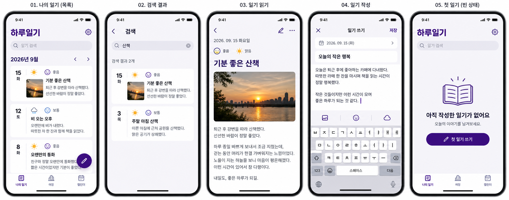
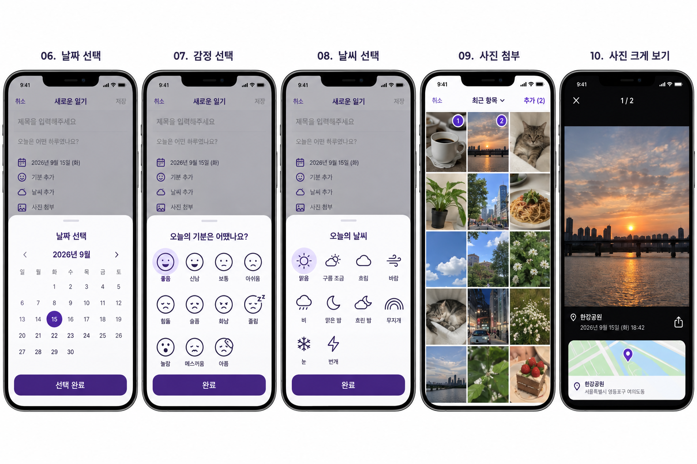
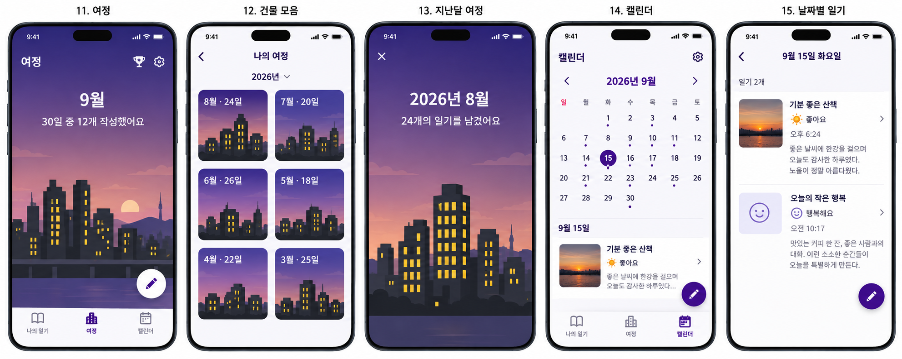
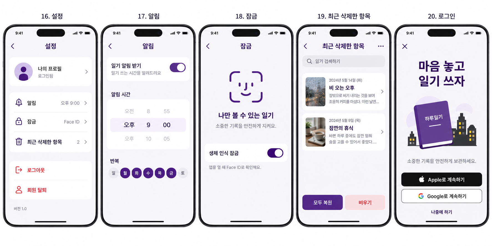
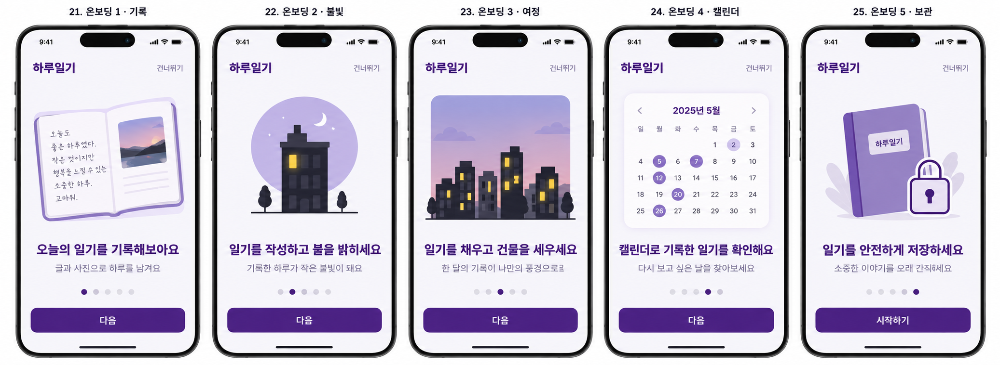
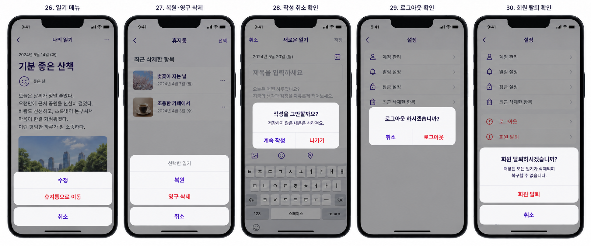

# 디자인 참고 목업 · v2

SwiftUI 리빌딩을 위한 마지막 목업 6장입니다. 기존 작업의 `mockups/redesign-v2` 원본을 그대로 보관합니다.
화면 구성과 시각적 방향을 함께 참고하기 위한 시안이며, 구현 완료 화면이나 모든 기능의 확정 명세는 아닙니다.

## 참고 기준

- 색상·타이포·여백·반복 UI는 이 시안을 함께 검토한 뒤 공통 기준으로 정합니다.
- 이미지에 보이는 문구·수치는 예시입니다. 데이터 계약과 기존 기능은 별도 검증합니다.
- **여정·월간 화면의 건물 불빛 표현은 수정 전 시안입니다.** 사용자 의도는 월간 완성으로 건물이 세워지고 누적되어 마을이 생기는 방향입니다. 상세 규칙과 디자인은 추후 논의하며, 이 이미지의 불빛 표현을 확정 사양으로 구현하지 않습니다.
- [리팩토링 로드맵](../../REFACTORING_ROADMAP.md)과 [UIKit → SwiftUI 전환 준비](../../UIKIT_SWIFTUI_MIGRATION.md)를 함께 확인합니다.

## 화면 미리보기

### 1. 일기 목록·상세

### 2. 일기 작성

### 3. 여정·캘린더

### 4. 설정

### 5. 온보딩

### 6. 대화상자

